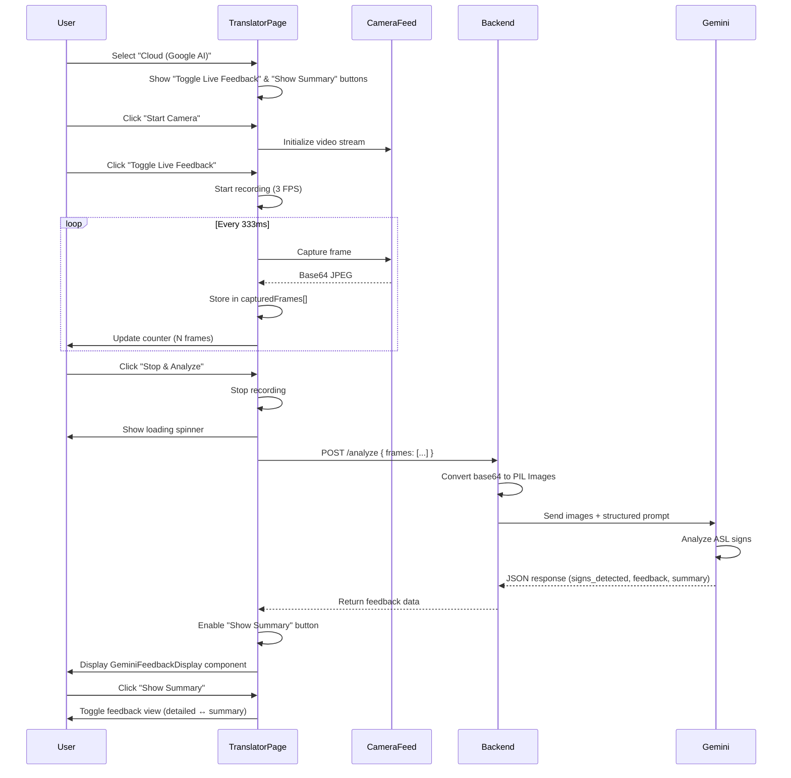

```mermaid
sequenceDiagram
    participant User
    participant TranslatorPage
    participant CameraFeed
    participant Backend
    participant Gemini

    User->>TranslatorPage: Select "Cloud (Google AI)"
    TranslatorPage->>TranslatorPage: Show "Toggle Live Feedback" & "Show Summary" buttons
    
    User->>TranslatorPage: Click "Start Camera"
    TranslatorPage->>CameraFeed: Initialize video stream
    
    User->>TranslatorPage: Click "Toggle Live Feedback"
    TranslatorPage->>TranslatorPage: Start recording (3 FPS)
    
    loop Every 333ms
        TranslatorPage->>CameraFeed: Capture frame
        CameraFeed-->>TranslatorPage: Base64 JPEG
        TranslatorPage->>TranslatorPage: Store in capturedFrames[]
        TranslatorPage->>User: Update counter (N frames)
    end
    
    User->>TranslatorPage: Click "Stop & Analyze"
    TranslatorPage->>TranslatorPage: Stop recording
    TranslatorPage->>User: Show loading spinner
    
    TranslatorPage->>Backend: POST /analyze { frames: [...] }
    Backend->>Backend: Convert base64 to PIL Images
    Backend->>Gemini: Send images + structured prompt
    Gemini->>Gemini: Analyze ASL signs
    Gemini-->>Backend: JSON response (signs_detected, feedback, summary)
    Backend-->>TranslatorPage: Return feedback data
    
    TranslatorPage->>TranslatorPage: Enable "Show Summary" button
    TranslatorPage->>User: Display GeminiFeedbackDisplay component
    
    User->>TranslatorPage: Click "Show Summary"
    TranslatorPage->>User: Toggle feedback view (detailed ↔ summary)
```
